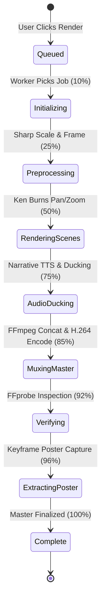

# 🏛️ LIFE MOVIE — Architectural Specification & Engineering Design

This document details the internal architecture, lifecycle states, data flows, and security boundaries of LIFE MOVIE.

---

## 1. System Overview & Core Principles

LIFE MOVIE is designed around three architectural pillars:
1. **Real Media Processing**: No CSS-simulated playback or client-rendered mock animations for the core output. All final movies are actual H.264/AAC MP4 video streams generated on the server using FFmpeg.
2. **Deterministic & AI Synergy**: User intent is captured via structured interview questions and high-resolution photo/video uploads. Google Gemini AI generates a 5-act screenplay, while a deterministic rendering engine enforces cinematic framing (2.39:1 Cinemascope), typography, and audio ducking.
3. **Strict Data Ownership & Relational Integrity**: All user assets, interview responses, screenplay acts, and render jobs are bound relationally through Prisma and persisted to local SQLite storage.

---

## 2. Component Architecture

```mermaid
graph TD
    subgraph Client Layer
        A[Next.js React 19 Frontend] -->|HTTP / Cookies| B[API Gateway / Route Handlers]
    end

    subgraph API & Domain Layer
        B --> C[AuthService]
        B --> D[UploadService / Sharp]
        B --> E[StoryRouter]
        B --> F[RenderService / Worker]
    end

    subgraph Processing Engine
        E -->|AI Screenplay| G[Gemini 2.5 Flash Engine]
        E -->|Fallback| H[Deterministic Story Engine]
        F --> I[FFmpeg CLI Runner]
        F --> J[MediaProbe (ffprobe)]
        F --> K[Narrator & Audio Ducking Mixer]
        F --> L[Subtitle & Title Overlay Renderer]
    end

    subgraph Persistence Layer
        C --> M[(Prisma SQLite Database)]
        D --> M
        D --> N[(Local Filesystem Storage)]
        E --> M
        F --> M
        F --> N
    end
```

---

## 3. Detailed Data Flows

### A. Authentication & Session Flow
1. **Registration / Login**: User submits email + password to `/api/auth/register` or `/api/auth/login`.
2. **Password Verification**: Password verified using `bcryptjs` (salt rounds: 10).
3. **JWT Issuance**: `jose` generates a signed JWT payload containing `{ sub: userId, email, exp }`.
4. **Cookie Transmission**: Transmitted via `Set-Cookie` header with flags: `HttpOnly; SameSite=Lax; Path=/; Max-Age=604800; [Secure if prod]`.
5. **Session Resolution**: `AuthService.getSession(req)` reads and cryptographically validates the cookie on all protected API routes.

### B. Media Upload Flow
1. **Multipart Submission**: Browser posts `multipart/form-data` with `file`, `projectId`, `caption`, `date`, `location` to `/api/upload/file`.
2. **Validation**: Server checks MIME type (`image/jpeg`, `image/png`, `image/webp`, `video/mp4`) and verifies file size (max 50MB).
3. **Sharp Processing**: Sharp normalizes EXIF orientation, extracts pixel dimensions, and generates a fast thumbnail.
4. **Filesystem Write**: Binary is written to `.storage/users/{userId}/projects/{projectId}/media/{memoryId}/original.{ext}`.
5. **Prisma Insertion**: A `Memory` record is created in SQLite pointing to `/api/storage/users/...` URL.

### C. Gemini Screenplay Generation Flow
1. **Request**: Studio modal posts project details, memory list, and 6-question director interview answers to `/api/story/generate`.
2. **Prompt Assembly**: The system constructs a structured system instruction specifying the 5-act dramatic arc (Introduction, Rising Action, Climax, Falling Action, Resolution) with JSON schema output.
3. **Gemini Invocation**: Invokes `gemini-2.5-flash` with response schema enforcement.
4. **Persistence**: The screenplay is parsed and saved in the SQLite `StoryOutline` and `StoryChapter` tables.
5. **UI Binding**: 5 screenplay cards with handwritten beats and synopsis appear in the client studio for director approval.

### D. Cinema Rendering Pipeline Lifecycle



1. **Job Dispatch**: `/api/render/jobs` creates a `GenerationJob` with status `"queued"`.
2. **Worker Execution**: `RenderWorker` picks the job and executes `RenderService.render(jobId)`.
3. **Scene Generation**: For each screenplay chapter, `RenderService` crops images to 1920×804, generates SVG title cards, and runs FFmpeg zoompan filter.
4. **Audio Mixing**: `NarratorMixer` combines ambient soundtrack with narration stems, ducking music to 45% volume during active voice intervals.
5. **Master Concat**: Concatenates scene segments into a single progressive MP4 with `libx264` and `aac`.
6. **FFprobe Verification**: `MediaProbe` validates 1920×804 geometry, 24 FPS framerate, audio channels, and duration > 0s.
7. **Poster Extraction**: Extracts high-quality keyframe at `00:00:01` to `.storage/.../poster.jpg`.
8. **Finalization**: Updates database job to `"complete"` with output URL `/api/render/jobs/{jobId}/video.mp4`.

---

## 4. Security Boundaries

- **Input Validation**: Strict schema checks on all incoming JSON payloads.
- **Path Traversal Protection**: Media storage paths are resolved using strict ID-based subdirectories with sanitized components.
- **Command Injection Prevention**: FFmpeg execution uses binary argument arrays (`spawn`), preventing shell interpolation.
- **Access Control**: Relational ownership check enforces `userId === project.userId` before granting read/write/render access.
- **Public Share Sanitization**: Public film endpoints (`/api/public/film/[id]`) return only public metadata and omit passwords, email addresses, and draft data.
