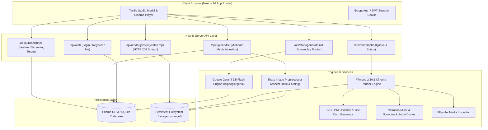

# 🎬 LIFE MOVIE

> **Turn your photos, videos, and cherished life memories into a cinematic 2.39:1 widescreen film powered by Google Gemini AI and server-side FFmpeg rendering.**

---

## 📖 What It Does

LIFE MOVIE bridges the gap between static photo galleries and motion picture storytelling. Designed with an editorial tactile aesthetic (paper textures, washi tape, 35mm contact sheets, and warm analog typography), LIFE MOVIE guides creators through a director-led workflow:

1. **Create a Film Project**: Organize memories into focused archival projects.
2. **Upload Memories**: Ingest high-resolution photos and video clips directly into persistent storage with automated metadata extraction.
3. **Complete the Director Interview**: Answer 6 structured narrative questions to define tone, turning points, and emotional resonance.
4. **Generate AI Screenplay**: Google Gemini (`gemini-2.5-flash`) synthesizes your memories and interview answers into a structured 5-act screenplay with handwritten beats, visual synopses, and pacing.
5. **Select Director Aesthetic**: Choose from signature cinematic treatments (Nostalgia 35mm, Documentary, French New Wave, Wes Anderson, Noir, Blockbuster) with tailored color LUTs, typography, and pacing.
6. **Server-Side FFmpeg Rendering**: Render a true 1920×804 (2.39:1 Cinemascope) H.264 master film complete with transparent subtitle overlays, narration, and background audio ducking.
7. **Playback & Download**: Stream via HTTP 206 Partial Content or download the full master `.mp4` binary.
8. **Public Screening Room**: Share your completed film via a public screening link (`/film/[id]`) with fine-grained access control.

---

## 🏛️ System Architecture



---

## ⚡ Tech Stack

| Domain | Technologies |
|---|---|
| **Framework** | Next.js 16 (App Router with Turbopack), React 19, TypeScript 5 |
| **Styling** | Tailwind CSS v4, GSAP Animations, Canvas Confetti |
| **AI Story Engine** | Google Gemini (`gemini-2.5-flash`) via `@google/genai` (v2.19.0) |
| **Cinema Rendering** | FFmpeg (H.264 / AAC / 2.39:1 Cinemascope), FFprobe |
| **Image Processing** | Sharp (EXIF normalization, 35mm aspect framing) |
| **ORM & Database** | Prisma ORM 6.4, SQLite (`prisma/dev.db`) |
| **Authentication** | Salted bcrypt (`bcryptjs`), Signed JWT session cookies (`jose`) |
| **Storage Driver** | Local filesystem storage hierarchy (`.storage/users/{id}/...`) |
| **Testing** | Node test runner + tsx integration suite (62 automated tests) |

---

## 📋 System Requirements

- **Node.js**: `v20.x` or higher (tested on Node v20 & v22)
- **npm**: `v10.x` or higher
- **FFmpeg & FFprobe**: `v5.0` or higher installed in system PATH (or configured via `FFMPEG_PATH` / `FFPROBE_PATH`)
- **Google Gemini API Key**: Free or paid tier from [Google AI Studio](https://aistudio.google.com/)
- **Operating System**: macOS, Linux, or Windows (WSL2 recommended for Windows)

---

## 🚀 Local Setup & Installation

### 1. Clone the Repository
```bash
git clone https://github.com/suvendukungfu/life-movie-ai.git
cd life-movie-ai
```

### 2. Install Dependencies
```bash
npm install
```

### 3. Configure Environment
```bash
cp .env.example .env
```
Edit `.env` and provide your Gemini API key and a secure session secret:
```env
DATABASE_URL="file:./dev.db"
AUTH_SECRET="your-32-char-random-secret-key"
GEMINI_API_KEY="AIzaSy..."
PORT=3001
```

### 4. Initialize Database
```bash
npx prisma db push
```

### 5. Start Development Server
```bash
npm run dev -- -p 3001
```
Open **`http://localhost:3001`** in your browser.

---

## 🧪 Verification & Testing

LIFE MOVIE includes a comprehensive multi-tier automated test suite:

```bash
# Run backend integration, FFmpeg rendering, and Gemini AI integration tests
npm test

# Run production build validation (TypeScript + Next.js static asset compilation)
npm run build

# Run comprehensive 34-step E2E reality audit against live server
npx tsx scripts/e2e-reality-audit.ts
```

### Verified Test Results
- **Automated Tests**: **62 / 62 PASSED**
- **E2E Reality Verification Steps**: **34 / 34 PASSED**
- **Production Build**: **0 errors, 0 warnings**

---

## 🎞️ Real Rendering Pipeline Breakdown

LIFE MOVIE does **not** simulate video creation with CSS animations or timed mock delays:

1. **Screenplay Ingestion**: Gemini generates 5 distinct narrative acts tied to memory IDs.
2. **Visual Normalization**: Sharp scales and crops uploaded images to cinema dimensions (1920×804).
3. **Motion Generation**: FFmpeg applies cinematic pan/zoom (Ken Burns effect) across scene duration.
4. **Title & Subtitle Burn**: SVG overlays with customized serif fonts and badges are generated and rendered over video frames.
5. **Audio Synthesis & Ducking**: Spoken voiceover stems and ambient score are mixed; background music volume automatically ducks to 45% during narration cues.
6. **Muxing & Encoding**: FFmpeg encodes the stream with `libx264` (CRF 20, 24 FPS, `+faststart`) and `aac` stereo audio (48kHz, 192kbps).
7. **Metadata Probing**: `MediaProbe` verifies geometry (1920×804), frame count, and audio tracks before marking the job complete.
8. **Poster Extraction**: A master keyframe is extracted at `00:00:01` as a high-quality JPEG poster.

---

## 🔒 Security & Privacy Architecture

- **Password Security**: Passwords are hashed with salted `bcryptjs` (salt rounds: 10).
- **Session Tokens**: JWT tokens are signed using HMAC-SHA256 (`jose`) and transmitted in `HttpOnly`, `SameSite=Lax` cookies.
- **Access Control**: Users can only access, edit, and render projects they own. Cross-user access attempts are rejected with HTTP 403 Forbidden.
- **API Key Isolation**: `GEMINI_API_KEY` is strictly confined to server-side routes; zero client-side leakage.
- **Safe Command Execution**: FFmpeg/FFprobe binaries are executed strictly using safe array argument vectors via `child_process.spawn`. No arbitrary shell string execution.

---

## 📂 Project Structure

```
life-movie-ai/
├── app/                        # Next.js 16 App Router
│   ├── api/                    # Server API routes
│   │   ├── auth/               # Register, Login, Logout, Me
│   │   ├── projects/           # Project CRUD & director interview
│   │   ├── public/film/        # Sanitized public screening endpoint
│   │   ├── render/jobs/        # Render job dispatch, telemetry & video streams
│   │   ├── storage/            # Binary media delivery route
│   │   ├── story/generate/     # Gemini AI screenplay generation
│   │   └── upload/file/        # Multipart file upload handler
│   ├── film/[id]/              # Public film screening page
│   ├── layout.tsx              # Root HTML & typography layout
│   └── page.tsx                # Main cinema studio experience
├── components/                 # React 19 UI components
│   ├── modal/                  # MakeMovieExperienceModal (Director Studio)
│   ├── movie-player/           # CinemaPlayer (2.39:1 video playback & controls)
│   ├── paper/                  # FilmGrain, Doodles, WashiTape aesthetic elements
│   ├── scrapbook/              # Visual memory pinboards & polaroids
│   └── story-chapters/         # Act 1-5 screenplay review cards
├── lib/                        # Core backend & business logic
│   ├── ai/                     # GeminiStoryProvider & DeterministicStoryProvider
│   ├── auth/                   # AuthService & session management
│   ├── db/                     # Prisma client instance
│   ├── rendering/              # RenderService, FFmpegRunner, MediaProbe, SubtitleOverlay
│   ├── security/               # RateLimiter & input validation
│   ├── storage/                # LocalStorageDriver (filesystem persistence)
│   └── types/                  # Strict domain & screenplay interfaces
├── prisma/                     # Database schema & migrations
│   └── schema.prisma           # Prisma SQLite models
├── scripts/                    # Maintenance & verification utilities
│   └── e2e-reality-audit.ts    # 34-step live pipeline audit runner
└── tests/                      # Automated test suite
    ├── backend-integration.test.ts # Auth, Prisma, Storage tests
    ├── gemini-test.ts          # Live Gemini 2.5 Flash story tests
    └── rendering/              # FFmpeg render pipeline tests
```

---

## 🤝 Contributing Workflow

We welcome contributions! Please follow our established engineering conventions:

1. **Fork & Branch**: Create a feature branch from `main` (e.g., `feat/cloud-storage-adapter` or `fix/render-timeout`).
2. **Code Standards**: Maintain strict TypeScript typing (`no implicit any`). Escaped HTML entities in JSX.
3. **Test First**: Ensure all tests pass before submitting:
   ```bash
   npm test && npm run build
   ```
4. **Conventional Commits**: Format commit messages according to Conventional Commits (e.g., `feat:`, `fix:`, `docs:`, `chore:`).
5. **Open Pull Request**: Use the provided [PR Template](.github/pull_request_template.md).

For more details, see [CONTRIBUTING.md](CONTRIBUTING.md).

---

## ⚠️ Known Limitations

- **Single-Node Queue**: The current render queue runs in-process on the local server. For multi-server production scale, a Redis/BullMQ worker is planned.
- **Local Filesystem Default**: By default, media binaries are saved to `.storage/` on the local machine. Cloudflare R2 / S3 adapters are scheduled for v0.3.
- **TTS Synthesis**: Spoken voiceover currently utilizes system TTS (`say` on macOS) or synthesized audio cues. External ElevenLabs integration is on the v0.3 roadmap.

---

## 📜 License

This project is licensed under the MIT License — see the [LICENSE](LICENSE) file for details.
