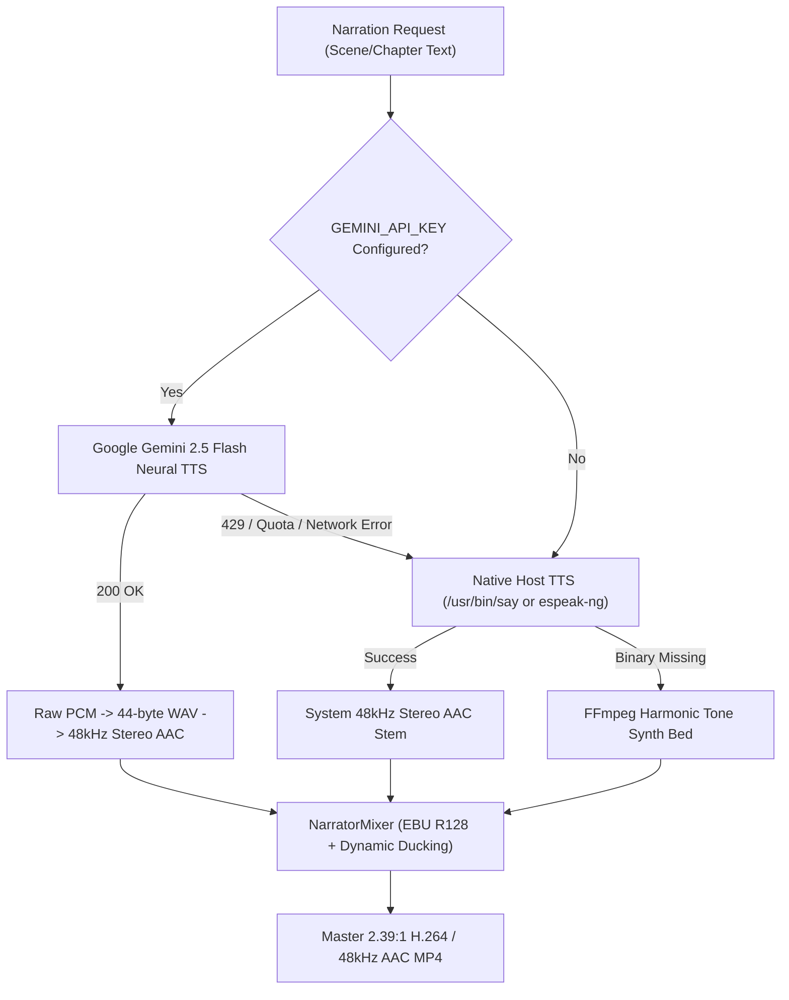

# 🎙️ LIFE MOVIE — v0.3 Cinematic Narration & Audio Implementation

**Milestone**: v0.3.0 Cinematic Narration Pipeline  
**Target Branch**: `feat/v0.3-gemini-cinematic-tts`  
**Base**: `main` (v0.2.0 production baseline)  
**Lead Media Pipeline Engineer**: Google DeepMind / Antigravity Engineering  
**Date**: August 29, 2026  

---

## 1. Architectural Overview

LIFE MOVIE v0.3 elevates the auditory experience to **theatrical cinema quality** through four decoupled, zero-cost engineering subsystems:

1. **Google Gemini 2.5 Flash Neural Narration Engine** (`lib/audio/gemini-tts-provider.ts`):
   - Interfaces directly with `@google/genai` using server-only `process.env.GEMINI_API_KEY`.
   - Directs speech prosody, emotive inflection, and character casting using prebuilt voices (`Puck`, `Charon`, `Kore`, `Fenrir`, `Aoede`).
   - Converts raw PCM audio payloads (`audio/pcm;rate=24000`) into canonical 44-byte WAV containers and converts/normalizes them to 48kHz stereo AAC stems.
   - Robust exponential backoff and timeout handling on 429 quota exhaustion.

2. **Harmonic Cinema Score Generator** (`lib/audio/cinema-score.ts`):
   - Replaces static monotone sine waves with a multi-layered harmonic chord engine using FFmpeg `lavfi`.
   - Generates tailored root + 3rd + 5th + sub-bass drone progressions for each director style (`nostalgia`, `documentary`, `cinematic`, `romantic`, `youthful`, `dramatic`).

3. **Dynamic Audio Ducking & EBU R128 Loudness Mastering** (`lib/audio/narrator-mixer.ts`):
   - Dynamically ducks background music under active spoken voice intervals.
   - Applies studio-grade highpass/lowpass presence vocal equalization.
   - Normalizes final master audio to standard broadcast loudness: **EBU R128 (`loudnorm=I=-16:TP=-1.5:LRA=11`)** in 48kHz stereo AAC at 192kbps.

4. **Persistent Chapter Narration Service & Cross-Tenant Security** (`lib/audio/narration-service.ts`):
   - Synthesizes and saves audio stems per chapter into `.storage/users/{userId}/projects/{projectId}/audio/`.
   - Records metadata (`provider`, `model`, `voice`, `durationSec`, `sampleRate`, `channels`) in Prisma SQLite `AudioAsset`.
   - Enforces strict user ownership verification and root directory containment checks against path traversal.

---

## 2. Voice Profiles & Director Casting

| Profile ID | Profile Name | Gemini Voice | Pacing | Emotional Tone | Aesthetic Alignment |
|---|---|---|---|---|---|
| `nostalgia` | Nostalgic Polaroid | `Puck` | 0.95x | Reflective | 35mm golden hour, personal journals |
| `cinematic` | Theatrical Cinema | `Charon` | 0.92x | Dramatic | Widescreen life sagas, theatrical trailers |
| `documentary` | Archival Chronicle | `Fenrir` | 1.00x | Neutral | Historical chronicles, college years |
| `romantic` | Intimate Journal | `Kore` | 0.95x | Warm | Love stories, weddings, deep bonds |
| `youthful` | Golden Indie | `Aoede` | 1.05x | Hopeful | Road trips, graduation, adventures |
| `dramatic` | Film Noir | `Charon` | 0.90x | Dramatic | Turning points, high-contrast epics |

---

## 3. Database Schema Updates

Added the `AudioAsset` model to `prisma/schema.prisma`:

```prisma
model AudioAsset {
  id          String   @id @default(cuid())
  projectId   String
  project     Project  @relation(fields: [projectId], references: [id], onDelete: Cascade)
  chapterId   String?
  provider    String   // gemini | system | harmonic
  model       String   // gemini-2.5-flash | system-say | etc.
  voice       String   // Puck | Charon | Kore | Fenrir | Aoede | default
  storageKey  String
  mimeType    String   @default("audio/aac")
  durationSec Float    @default(0)
  sampleRate  Int      @default(48000)
  channels    Int      @default(2)
  createdAt   DateTime @default(now())
  updatedAt   DateTime @updatedAt

  @@index([projectId])
  @@map("audio_assets")
}
```

---

## 4. Multi-Tier Voice Fallback Architecture



---

## 5. Security & Privacy Audit

1. **Zero Client Leakage**: `GEMINI_API_KEY` is loaded strictly on the server (`lib/config/env.ts`). Zero references in client-side bundles or `NEXT_PUBLIC_*`.
2. **Strict Project Scoping**: All audio endpoints and database records verify `project.userId === session.userId`.
3. **Path Traversal Containment**: Audio storage drivers reject `..`, `/`, and `\` in IDs and verify physical path resolution within `.storage/`.
4. **Safe Process Spawn**: FFmpeg and `/usr/bin/say` run exclusively via `child_process.spawn` argument arrays. Shell string interpolation is strictly prohibited.
